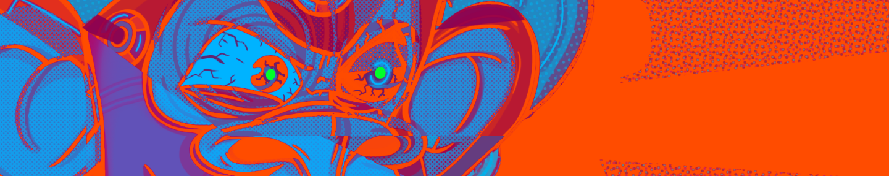

# REMIX! Halloween

**什么是混音！俱乐部？**
混音！俱乐部将 NFT 收藏家与当今最令人兴奋的 NFT 艺术家聚集在一起！该俱乐部提供了与空间中最大的 NFT 艺术家互动的独特途径，并创造了独家艺术收藏品。

混音！Club 最初是由 24 位当今最热门的 NFT 艺术家创作的 50 件 BAYC 衍生艺术品的集合，每个 NFT 都内置了稀有等级和实用程序。这些原创 REMIX！NFT 现在是您向狂热的收藏家和艺术家社区的会员通行证。

混音！Club 的使命是消除 NFT 噪音，并汇集提供当今空间顶级项目的所有功能（艺术品、社区、实用程序、游戏化、烧钱）的精选收藏品。

