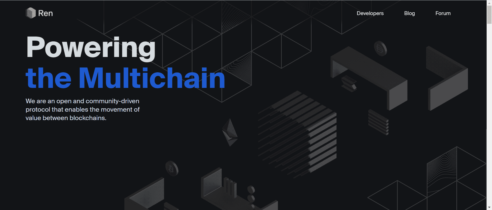

# Ren

一个安全的虚拟计算机网络，为去中心化应用程序提供互操作性，支持跨链借贷、交换、抵押等。

是一个开放和社区驱动的协议，可以在区块链之间转移价值。数十个领先的 Web3 应用程序使用 Ren 解锁了原生跨链用户体验。

Ren 的未来是将区块链无缝连接为第 0 层。开发人员很快将能够在 Ren 之上构建其应用程序的单一实现，从而可以访问整个多链世界。

Ren 包裹的资产是 1:1 的代币，代表各种区块链上的基础资产。这就是 Ren 通过提供转换为原生链代币格式的资产表示来增强底层互操作性的方式，最终允许资产在任何协议上运行。

