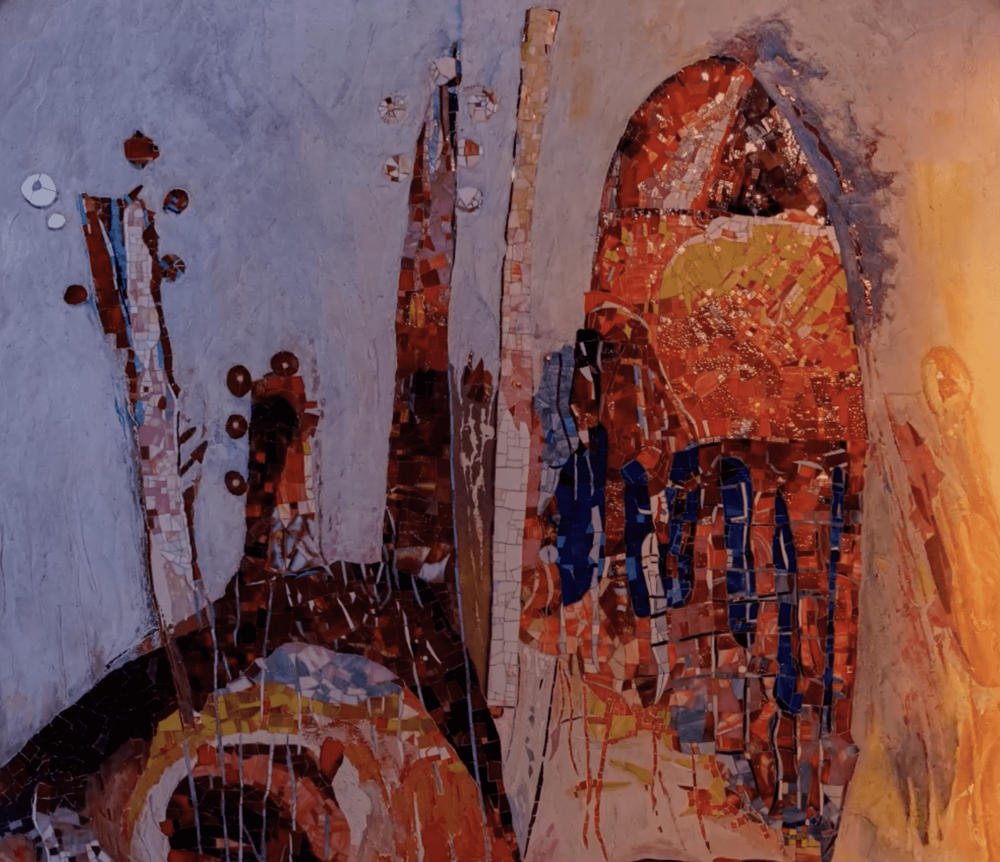

# renaissance-nft

阿曼·费尔南德斯

出生于法国的作家。
他最初参与了新现实主义的创立，并成为该组织的领军人物。
他创造了“累积”艺术，将日常物品、垃圾和破碎的乐器放在
一个玻璃盒子里，然后排列和堆叠。
在阿尔芒的作品中，使用雷诺汽车厂零件的综合作品是最大的。

克里斯蒂安·卡雷尔·阿佩尔

作者来自荷兰阿姆斯特丹。
1948年，他是前卫团体CoBrA的创始人。
它是反对欧洲理性艺术而形成的，并
作为一种新的绘画运动表达自己的存在，打破了欧洲艺术的旧传统，
对欧洲当代艺术的发展产生了重大影响。

文艺复兴艺术与数字艺术的融合。 Renaissance NFT 是通过在 Klaytn 区块链上结合文艺复兴艺术创造的数字艺术。 NFT（Non-Fungible-Token）包含文艺复兴艺术品的人文主义、美好的人类情感、自然美和透视绘画。遇见“文艺复兴艺术”和“数字艺术”文艺复兴 NFT 将文艺复兴艺术与基于区块链的艺术结合起来通过组合创建的数字艺术。 NFT（Non-Fungible-Token）包含了文艺复兴艺术作品的人文主义，即人类的美好情感、自然之美、透视画。

