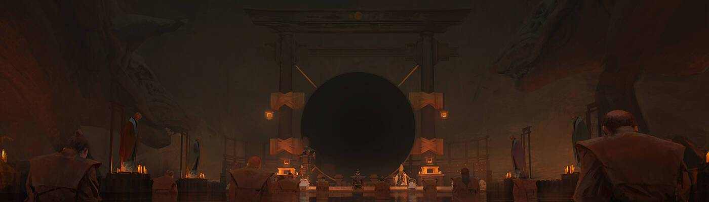

# Rengoku [Jade Cranes]

我该如何开始?
如果您是 Rengoku 的新手并想以持有者身份参与,第一步是获得一个或 多个武士。它们可以在二级市场上交易,例如外海.您想获得哪个武士以 及拥有什么属性取决于您;所有武士都将能够参加未来的活动。
获得 Samurai 后,我们建议您加入 Discord 服务器。您将找到有关该项目 的更多详细信息,并能够与社区中的其他人互动。您还会发现,通过 # collabland-join 频道验证自己是持有人,以便访问仅限持有人的频道, 这对您很有帮助。通过仪式作为奖励,玉鹤与武士具有不同且互补的效用。Jade Cranes为 其持有者提供了许多好处,包括:

- 当质押稍后上线时,代币质押奖励比 Samurai 更高。
氏族战争 2.0 中的独特实用程序。
-玉鶴持有者将成为鹤理事会的一员,对故事中具有全球影响的秘密事件 进行投票。
- 有机会为您的武士获得独特的装甲定制部件。
- 玉鹤不和角色。
- 随着时间的推移,额外的独特奖励。
玉鹤只能通过此仪式获得一次。他们可以在仪式周结束后领取,并且祭品 已经统计完毕。Jade Cranes 将在二级市场上进行交易。

