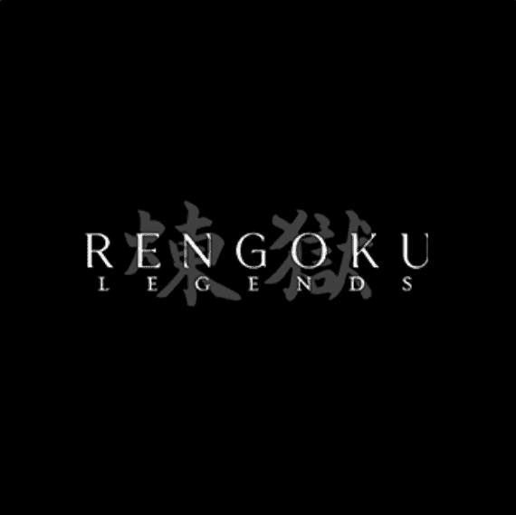

# Rengoku Legends [Samurai]

Rengoku Legends 是一个完全可定制的武士集合，具有视觉和音乐稀有性、机制和实用性。每个武士都将由每个持有者创建和定制。这个创世纪系列将成为由社区推动的身临其境的交互式 dnd 风格故事活动的门票。来自曾参与过《银翼杀手 2049》、《战地 2042》和《极品飞车》等项目的团队。

Rengoku Legends [Samurai] 是一个 NFT（不可替代令牌）集合。存储在区块链上的数字艺术品集合。

总共有 6,276 个 Rengoku Legends [Samurai] NFT。目前，3,369 位拥有者的钱包中至少有一个 Rengoku Legends [Samurai] NTF。

