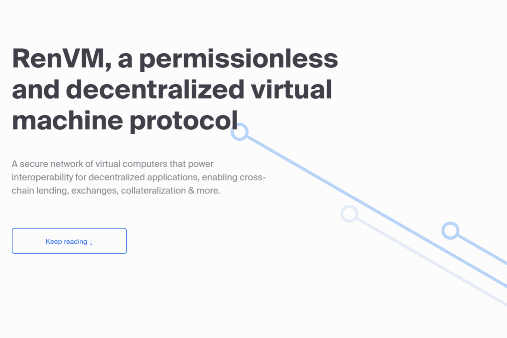

# RenVM

RenVM 如何为您的数据保密的基础 RenVM 如何有效地运行秘密脚本 在动态和潜在恶意环境中的正常运行时间 快速的去中心化共识

前提很简单：一个秘密被分成多个部分，秘密共享方案的参与者需要大部分部分才能重建秘密。

我们开创了自己最先进的 sMPC 算法，允许不受信任的暗节点联合运行脚本，而不会向任何人透露脚本的输入或输出，甚至不会向支持 RenVM 的机器透露。

即使暗节点变得不可用或出现恶意行为，我们的网络也会蓬勃发展。脚本继续运行，秘密保持秘密。

RenVM 使用专门为分片和 sMPC 设计的 Tendermint 共识算法的修改版本。

