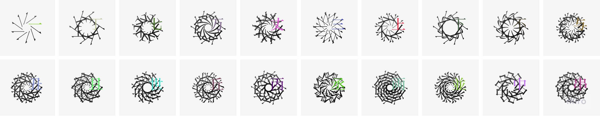

# Replica Kanji Flowers

汉字花
Kanji Flower 是一系列基于日本汉字字符的生成艺术收藏品。来自@peilingjiang 的 Cyberflowers 的概念和代码。

享受您自担风险！复制汉字花统计
创建于大约 1 年前
2,222 代币供应
2.5% 费用
过去 7 天没有出售复制汉字花。

欢迎来到 OpenSea 上的 Replica Kanji Flowers 之家。发现这个系列中最好的项目。

“来自@peilingjiang 的 Cyberflowers 的概念和代码。▶ 什么是复制汉字花？
Replica Kanji Flowers 是一个 NFT（不可替代令牌）集合。存储在区块链上的数字艺术品集合。
▶ 复制汉字花代币有多少？
总共有 2,222 个 Replica Kanji Flowers NFT。目前 280 位业主的钱包中至少有一个 Replica Kanji Flowers NTF。
▶ 最近卖了多少复刻汉字花？
过去 30 天内共售出 0 个 Replica Kanji Flowers NFT。

