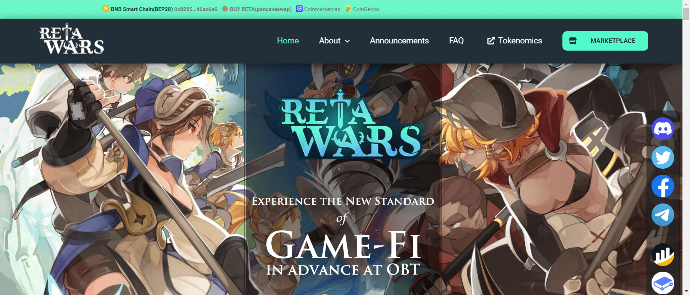

# Reta Wars

雇佣英雄，发展你的领地！

从战略上思考，并与你的派系团结起来！

带领派系取得胜利，并获得更大的奖励！

“Reta Wars”是一款模拟游戏，为 DeFi 添加了战略元素。特别是，它的目标是一个成熟的 Game-Fi，包括角色扮演、成长、竞争和机会等所有游戏元素。它不需要像动作游戏那样忙碌而快速的手部动作，但需要深思熟虑和明智的决定才能有效地控制英雄。玩家可以建立长期战略，将英雄放置在正确的位置，并根据他们的表现获得奖励作为利润。

