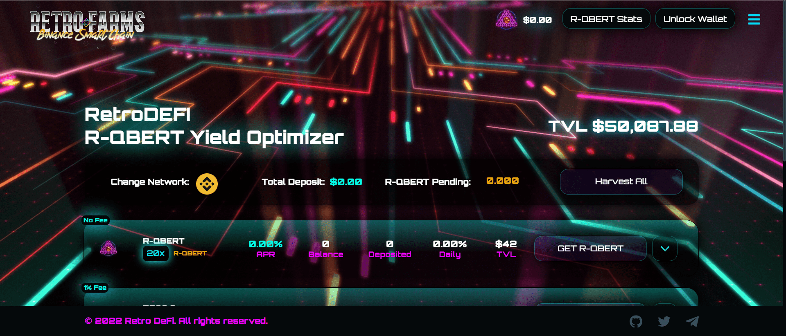

# RetroFarms

一体化去中心化金融生态系统。RETRO FARMS 旨在成为一个不断发展的多链产量优化平台。运行在币安智能链和多边形网络上，低费用和高速交易让用户即使是小额投资也能参与，打开每天增加资本的大门。改变用户增加收益的方式，我们为我们的代币持有者提供了一种自动分红的农业模式。从交易量中获得红利，同时通过我们增加您的资本！我们的目标是为社区提供各种工具，让他们以有趣和安全的方式提高产量。旨在像一个人一样运行，使命是将 DEFI 的核心理念带回游戏中，跟随最新趋势并使用最好和最值得信赖的 DEFI 方法。对于我们和我们的社区来说，安全是最重要的话题。经 Solidity Finance 审计，我们所有的合同都事先经过多方测试和审查。Retro Farms 使用最新的智能合约进行产量优化，并采用特殊策略进行修改，以确保最高回报。

