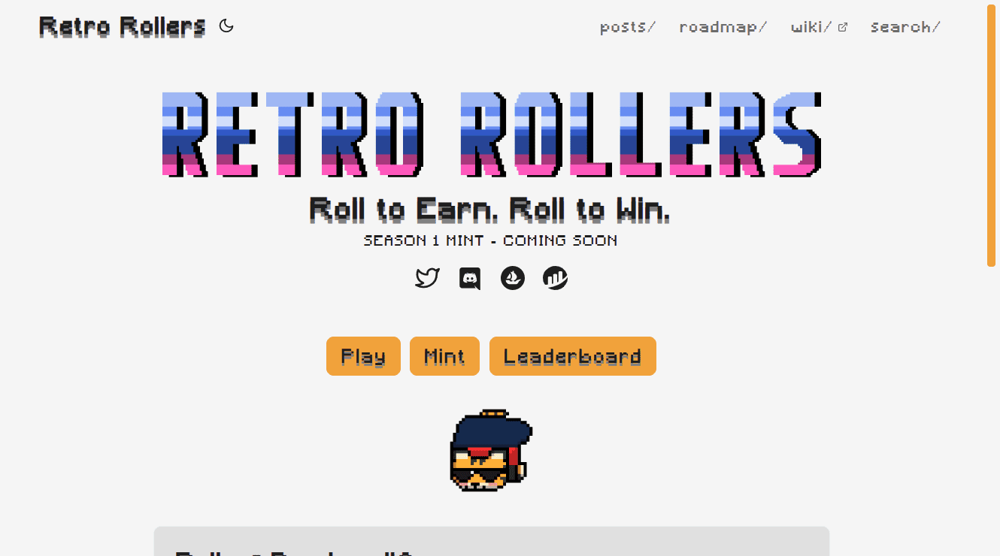

# Retro Rollers

嘿，Roller Fam，我们今天推出了许多错误修复和平衡更改，为我们本周五推出的多人 Alpha 版做准备。

平衡变化：

- 毒雾在游戏开始时相当无情，让新玩家很难适应控制而不在前一百米内死亡。我们降低了雾的启动速度，但在跑步过程中加快了速度。这使得前 500 米左右变得更容易，而 1 公里以上则变得有些困难。
- 我们对不同破折号的速度和持续时间进行了一些调整：大多数破折号稍微快一点，对角线破折号也稍长一些。
- 在高速行驶时，瓦斯爆炸是绝对的死刑判决，但在缓慢行驶时，它们更像是爆破气球。爆炸现在感觉就像爆炸，无论你走多快或多慢。

Bug修复：

- 修复了毒气罐在某些情况下爆炸后不会消失的问题。
- 更改了有毒雾的速度计算，以防止在极少数情况下达到无限速度。
- 多人游戏大厅和游戏代码中的一些错误修复。

今天还有一些视觉更新，看看你能不能发现它们！

