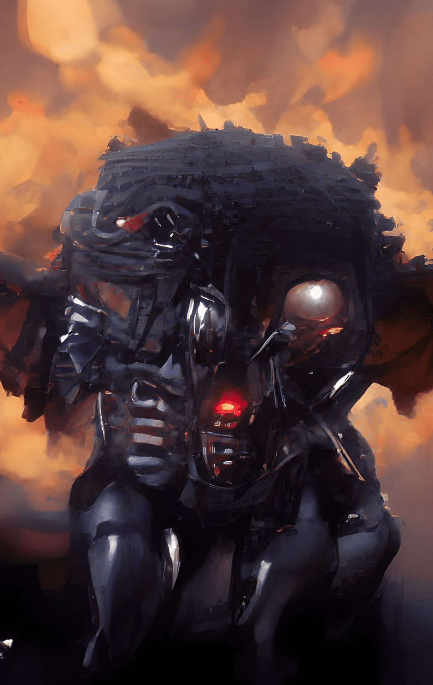

# Revealed AiGoblins

揭示了 AiGoblins 的统计数据
创建于 2 个月前
600 代币供应
4% 费用
在过去的 7 天里没有售出任何已显示的 AiGoblins。

实际揭晓，人为制造的“地精”艺术，你不必等待 1 个月才能看到,

▶ 什么是显形的地精？
Revealed AiGoblins 是一个 NFT（非同质代币）集合。存储在区块链上的数字艺术品集合。
▶ 有多少 Revealed AiGoblins 代币？
总共有 600 个 Revealed AiGoblins NFT。目前，263 位所有者的钱包中至少有一个 Revealed AiGoblins NTF。
▶ 最昂贵的 Revealed AiGoblins 销售是什么？
出售的最昂贵的 Revealed AiGoblins NFT 是 Revealed AiGoblins #7。它于 2022 年 6 月 16 日（2 个月前）以 16.9 美元的价格售出。
▶ 最近卖出了多少只已揭晓的地精？
过去 30 天内售出了 18 个 Revealed AiGoblins NFT。
▶ 一个显灵的地精要多少钱？
在过去 30 天里，最便宜的 Revealed AiGoblins NFT 销售额低于 3 美元，最高销售额超过 16 美元。Revealed AiGoblins NFT 的中位价格在过去 30 天内为 4 美元。

