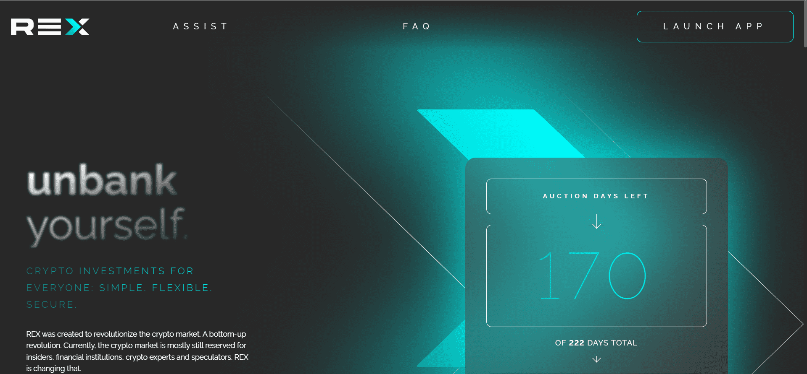

# Rex Token

REX：币安智能链上的新资产类别

REX 是 BSC 上的第一个存款证明 (CD) 代币。REX 也是第一个可以轻松转移存款（使其本身成为一种加密货币）并可以及早刮取利息的 CD 代币。这两个功能结合起来带来了一些新的东西：

资产增值加上被动收入。什么都不做。没有第三方，没有中间商，没有表格，没有信用检查，没有交易对手风险。并且无法关闭。听起来像是金融民主化？这是。  

