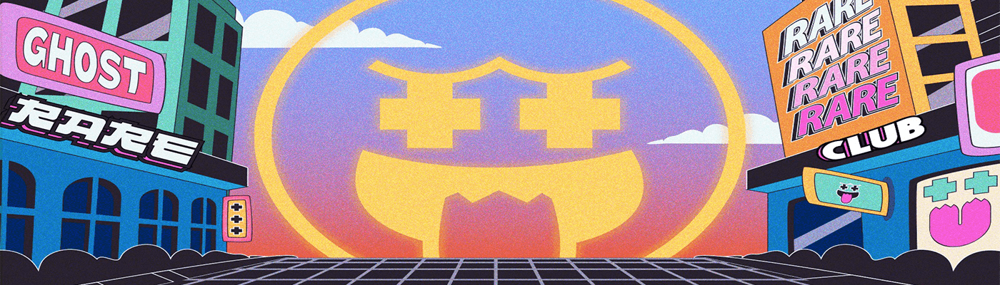

# Rare Ghost Club (RGC)

通过 Rare Ghost Club，我们将这种罕见的收藏体验发布到虚拟世界中，供 NFT 爱好者使用。每个 RGC Ghost 都是一个独特的 1-of-1 图像，由超过 263 种可能的特征组成，包括不同的身体、牙齿、眼镜、头饰、纹身等。

每个幽灵都是稀有的，但有些比其他的更稀有。每个 RGC Ghost 都是一个独特的 1-of-1 图像，由超过 263 种可能的特征组成，包括不同的身体、牙齿、眼镜、头饰、纹身等。Rare Ghost Club 并不是一个一次性的项目。我们的目标是围绕项目创建一个不断发展的生态系统和元界，同时不断为我们所有的持有者增加价值。我们的团队已经制定了一个路线图，说明我们想在哪里进行项目，并开始与我们的社区进行讨论。我们有很多想法正在研究，由于这是一个基于社区的项目，它将继续加班并不断发展。当您获得一个 Ghost 时，它将作为您加入 Rare Ghost 俱乐部的会员卡。这里只是一些会员专属福利：

