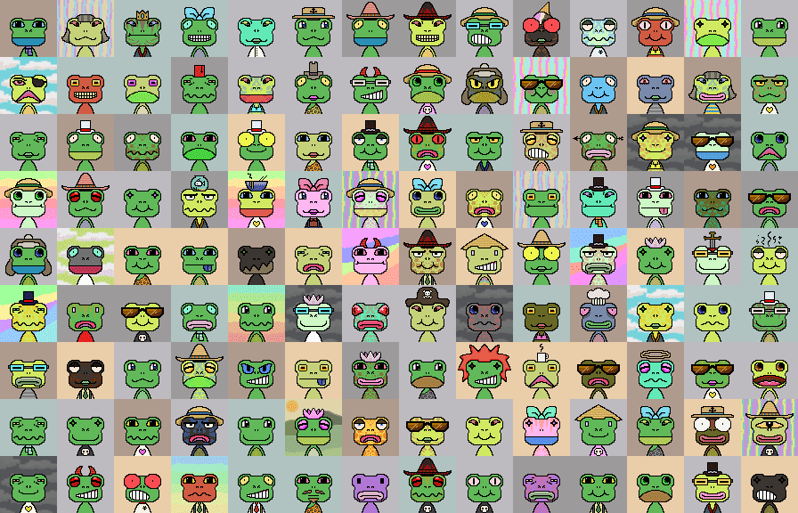

# Ribbits

里比斯
一组独特的 1,000 个可收藏和可交易的青蛙主题 NFT。
探索
在下方缩放和平移以查看所有 Ribbit。双击 Ribbit 将显示更多信息。

可以用0.1 ETH认领带有黑色边框的 Ribbits 。

包裹的Ribbits
Wrapping Ribbits 将它们从 ERC-721 代币转换为 ERC-20 代币，这些代币可以在 Uniswap 等交易所进行交易。

每个打包的 Ribbit 提供 1 个 wRBT 代币，wRBT 合约持有的任何 Ribbit 都可以打开并发送给您，以换取 1 个 wRBT。

- wRBT
  总供应量
  -以太坊
  当前 Uniswap 价格
  ( 40.5882 wRBT + 1.05706 ETH)

  
