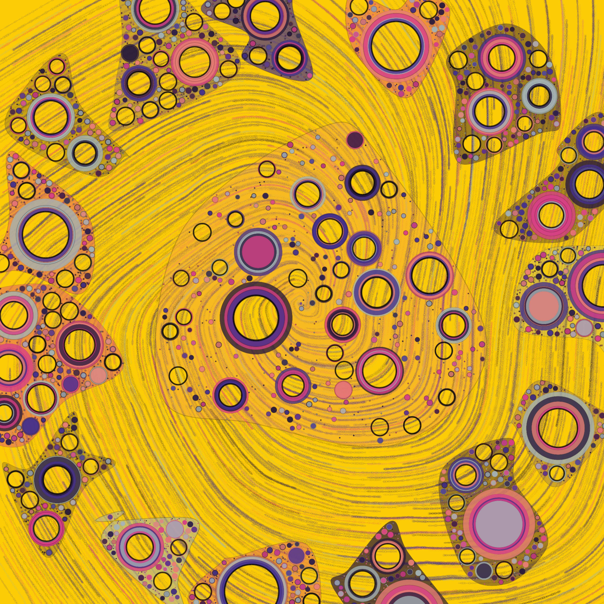

# RIBONZ: Infinity

现实由什么组成？我们是生活在模拟中，还是什么？RIBONZ 三部曲旨在探索解释我们现实的科学理论，帮助我们在答案不那么清楚的时候立足。

RIBONZ：创世纪以弦理论启发的形式开始，基本数学对象的振动创造了我们现实的结构。

RIBONZ：时空开始探索宇宙学和结构，从相对论和潜在能量场的引力扭曲中汲取灵感。

RIBONZ：Infinity 通过考虑空间之外可能存在的东西来结束三部曲。随着新的宇宙从真空中出现，这个由三部分组成的循环将继续……无限。

