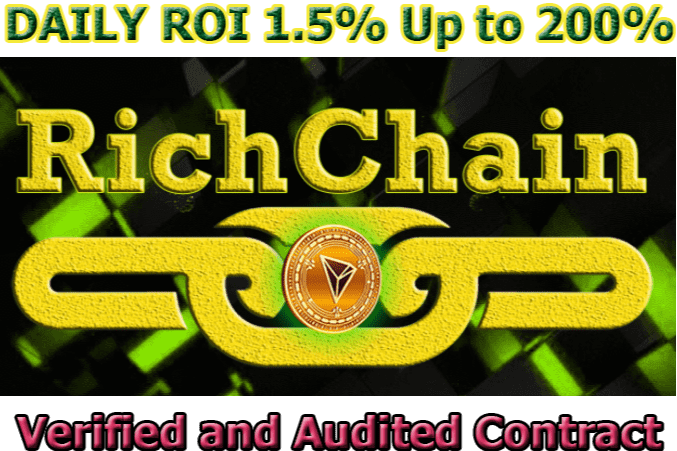

# RichChain

什么是富链？

100% 去中心化 P2P 交易智能合约。建立在波场区块链上的被动分红平台。完全验证和开源，交易可以在 TRONSCAN 的网站和智能合约的写入功能上完成。

➡️ DApp 世界增长最快的候选人

➡️亚洲，中国，泰国，越南，柬埔寨，老挝，马来西亚，印度尼西亚和/或等地的投资者大社区🌏

➡️诚实、透明和公平

🏅有吸引力的计划🏅

📌 1.5% 每日利润（可持续 134 天）

📌 200% 总利润

📌 15 级推荐奖金

📌 每日泳池赞助商奖金

📌 提高稳定性的激励措施

📌 最低投资只需 100 TRX

📌 10% 即时直接推荐佣金

📌 对所有社区成员诚实、透明和公平

💰 接收 RICH 代币 (TRC20) 进行进一步兑换

📌验证合约✅

