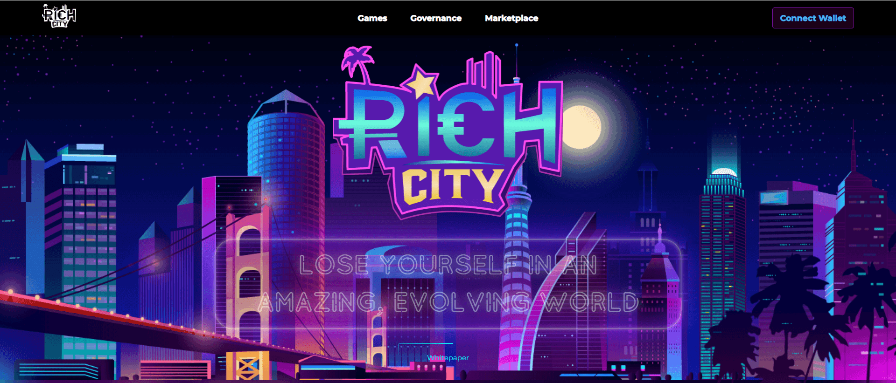

# RichCity

RichCity 是一个利用 Web3.0 技术的元宇宙，构建其 DAO、游戏、DeFi 生态系统，最后是 R 链。

我们将拥有 DAO，即 RichCitiy DAO，所有 gRICH 持有者都可以参与城市发展的治理。将控制权交给在 RichCity 中创造和玩耍的人们始终是最初愿景的一部分。

RichCity 将是一个充满酷炫 NFT 角色、设备、帮派和建筑物的游戏世界，玩家可以收集这些角色、设备、帮派和建筑物，以构建基于土地的元宇宙。

随着城市的发展，RichCity 也将为社区成员提供在 RichCity 平台上发布游戏的机会，逐步将 RichCity 打造成一个由所有社区成员共同开发的 UGC 平台。

在 RichCity 元宇宙中，参与者可以拥有其所有数字资产的永久所有权，也可以拥有其私人信息的全部所有权。RichCity 不会简单地构建游戏，而是使用 Web3.0 工具来制作真正的元宇宙。

RichCity 想要奖励所有参与生态系统的成员，也想要建立玩家对玩家的经济，那么强大的去中心化金融（DeFi）工具是必须的。

社区成员在 RichCity 中也将有多种赚钱方式。您可以成为赏金猎人并参与赚钱，也可以成为网络参与者并参与赚钱，或成为代币持有者并从代币交易中获利。

RichCity 将拥有自己的链——R-Chain，它将构建一个开放和无边界的区块链世界，可以简化供应链、提高可追溯性、简化贸易和改善金融交易。然后，我们可以邀请更多的合作伙伴和朋友，在 RichCity 虚拟世界中与他们一起享受美好时光。

