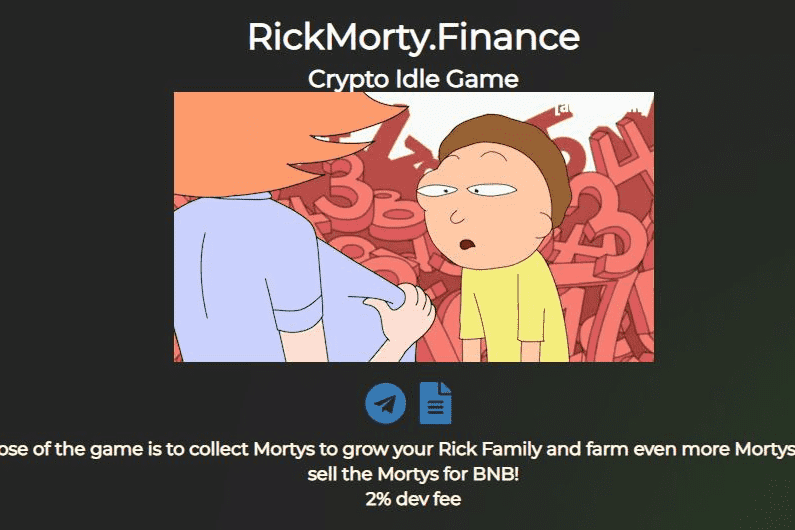

# RickMorty.finance

！！！- RickAndMorty 财经 - ！！！

游戏的目的是收集 Mortys 以发展您的 Rick Family 并种植更多 Mortys，或者选择交易 Mortys 以换取 BNB (AMM)

农业等级：

-Doofus Rick：在这一层，每个 Rick 每天只能刷 1 个莫蒂。（例如；100 只 Doofus Ricks 每天可以种植 100 只莫蒂）

- Rick C-137，Rickest Rick：在这一层中，每个 Rick 每天种植 10 个莫蒂。（例如；10 个原始瑞克斯将养殖 100 个莫蒂/天）

-Pickle Riiiiiicccccckkkkkkk：这是游戏中最好的等级，每个 Pickle Rick 农场每天 25 个 Mortys。（例如；4 Pickle Ricks 每天可以为您种植 100 Mortys）

- 开发费 2%（将用于回购）

-社区拥有，开发者放弃了所有权。

-地毯证明AMM（自动做市商）智能合约，人们仅与智能合约交互。 

Mortys/BNB 对卖出率基于合约中 BNB 的数量、存在的 Mortys 数量以及每笔交易的数量。

