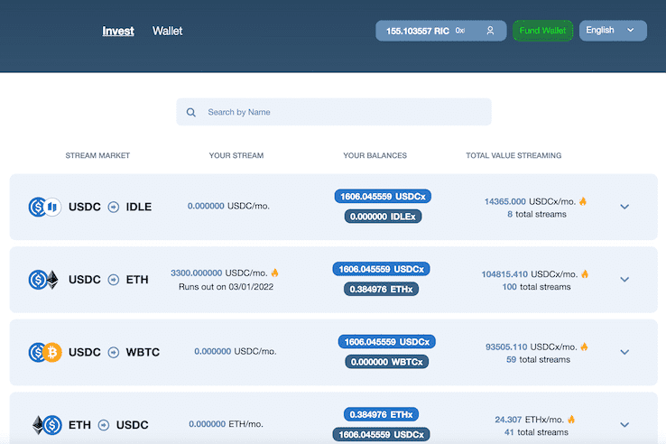

# Ricochet Exchange

Ricochet 将权力掌握在被动投资者手中。

Ricochet 使投资者能够通过单笔交易设置美元成本平均 (DCA)。用户可以在流中自动买卖加密货币，从而获得隐私、安全和低费用的好处。 

Ricochet 利用第 2 层基础架构（在 Polygon 上运行），并能够使用 Superfluid 的即时分发协议和 ERC777 为其流媒体实现频繁的交换和分发。 

Ricochet 是非托管的、完全自动的和不干涉的，并利用 DeFi 的力量提供轻松的实时加密投资。

