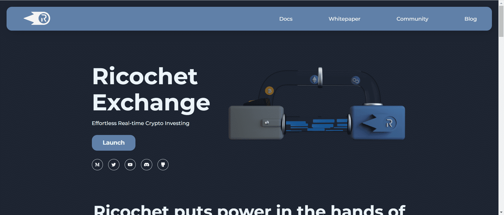

# Ricochet

Ricochet Exchange 专注于生产新颖的工具，允许人们使用 Superfluid 的金融框架实时投资他们的加密资产。

rexMarket - 弹跳| 流媒体交换

该项目涉及创建和维护一个支持 在 Polygon 上自动实时投资的去中心化交易所。Ricochet Exchange 合约使用 Superfluid 流式传输代币，使用 Tellor Oracle 获取价格，使用 SushiSwap/QuickSwap 获取流动性。个人和组织使用交易所将他们的资本和入境收入流实时投资进出 ETH、WBTC 和其他人。

rexLaunchpad

Launchpad 打算为用于进行公平 ICO 的项目创建一个启动板合约。该启动板通过以固定分配率提供代币来消除抢先交易。流媒体可以竞争以赚取一部分分配。请参阅下面的示例，其中价格发现将使 $RIC 的价格为 0.50 USDC。

雷克斯LP

REX 代币是 Ricochet Exchange 中使用的收益代币，用于向流媒体提供实时收益。REX 代币代表对在奖励系统（例如 SushiSwap Farms）中质押的可产生收益的 ERC20 代币的要求。流媒体将 USDC 流式传输到交易所以接收 REX 代币。令牌在底层令牌（例如 rexSLP）上用“rex”前缀表示。交易所获取基础代币并将其投入奖励系统。然后，流媒体将实时产生的奖励直接存入他们的钱包。

