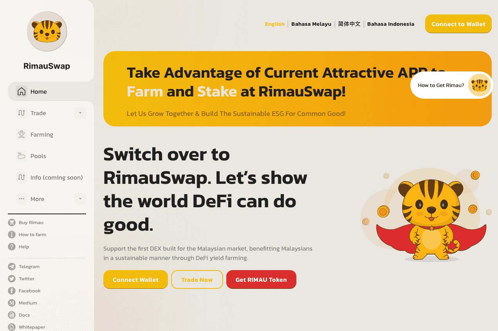

# RimauSwap

RimauSwap 是第一个在币安智能链上为马来西亚市场打造的去中心化交易所（DEX）。这是一个马来西亚人的公益项目，以可持续的方式使马来西亚人受益。 我们的思考和行动超越了利润，并且非常关心创建一个具有可持续社会影响的生态系统。

支持RIMAU Farm Pool，帮助弱势群体
通过使用 USDT 获取 RIMAU 代币并将其质押在 Belang Pool 中来支持我们的愿景，以赚取更多 RIMAU。通过 DeFi Yield Farming 和 Portfolio Management 提取 USDT 以产生收益。所得款项用于资助 ESG 慈善计划，以帮助弱势群体，并从公开市场回购 RIMAU 并烧毁。

RimauSwap 帮助您最大化您的加密资产价值，并在此过程中为马来西亚社区做出贡献。您可以与我们交易、赚取和贡献。

6845132
