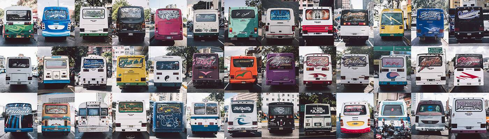

# RINDIENDO HONORES

很长一段时间以来，不仅在加拉加斯的街道上滚动和行走，我被一些公共汽车放置的信息所吸引。一些在后面，一些在前面。我一直觉得这是一个特别的好方法向所爱的人投降 问候；没有一个喜欢的人；一个联想≥n。这是第一组碰巧在街上滚动的作品，在区块链上直播。每件作品都向每辆公共汽车支付的荣誉致敬。在欢迎中。

**RINDIENDO HONORES NFT - 常见问题（FAQ）**
▶ 什么是 RINDIENDO 荣誉？
RINDIENDO HONORES 是一个 NFT（不可替代令牌）集合。存储在区块链上的数字艺术品集合。
▶ 存在多少 RINDIENDO HONORES 代币？
总共有 44 个 RINDIENDO HONORES NFT。目前，19 位所有者的钱包中至少有一个 RINDIENDO HONORES NTF。
▶ 最近卖出了多少 RINDIENDO HONORES？
在过去 30 天内售出 0 个 RINDIENDO HONORES NFT。

