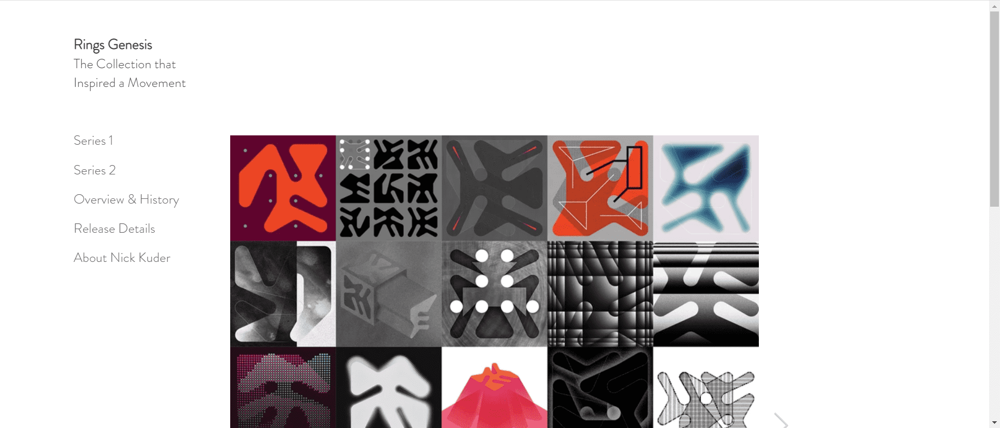

# Rings Genesis

激发运动灵感的系列。

这个标志性系列由艺术教授和平面艺术家尼克·库德 (Nick Kuder) 创作，是一系列正在进行的艺术作品。它最初于 2019 年 2 月创建，使用系统生成系统来创建独特的字形。

该系列受到牛品牌、流浪汉标志和其他字形系统的影响。其他影响包括元胞自动机和生物形态。

所有系列的最大件数将不超过 200。

作品和相关元数据存储在 Arweave 和 IPFS 上。

