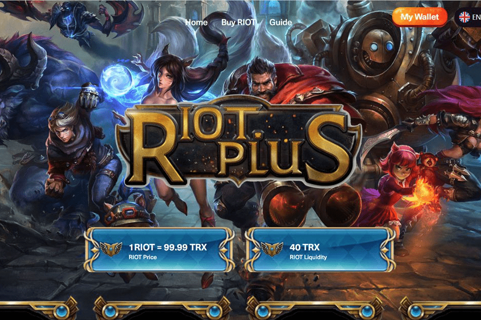

# RIOTPLUS

RIOT PLUS 的使命是为下一代 DeFi 和世界各地的人们创建一个新的金融基础设施。

基于区块链等新兴技术，全世界人民可以共同自由平等地拥有、建设和共享更好的资产、更好的交易所、更好的银行、更好的金融体系和更美好的未来，让全世界的每个人都能享受DeFi 的全球平等。

RIOT PLUS 是一个聚合有价值的去中心化金融协议的链上网络，让用户可以安全便捷地进行免费的金融交易、投资和资产配置，而用户作为 RIOT PLUS 代币持有者，可以从整个 RIOT PLUS 系统的价值增长中受益。

RIOT PLUS 建立在 TRON 区块链之上，我们相信 TRON 的稳定性、高可扩展性和低交易费用一定会帮助我们提供最好的以用户为中心的金融服务和用户体验。

