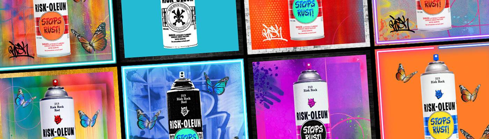

# RISKROCK NFT

旅程开始。世界知名涂鸦艺术家 RISK (Kelly Graval) 设计了他的第一个 NFT 系列。这些作品不仅仅是艺术品，还代表了一种跨越虚拟和物理世界的动态体验。
12.1.21 Discord 上线。RISK 的官方 Discord 服务器是所有艺术家、作家和我们的 NFT 收藏家可以在其项目中分享艺术、结交朋友和支持 RISK 的地方。

IRL 寻宝游戏。我们将在迈阿密巴塞尔艺术展期间推出我们的第一个街头活动“CANNONS”。RISK 是 Basel House 的特邀艺术家，他希望您加入体验。RISK 将在 Wynwood 各处种植带有 QR 码的罐头，也就是“大炮”。找到一个罐头，发布它，并在 Twitter 上标记 RISK 以成为具有特殊 Cannon 身份的会员，您可以将其列入白名单。另外，我们将赠送 RISK 本人的有形艺术品。RISK 将在他的 Twitter 帐户上宣布寻宝游戏。

