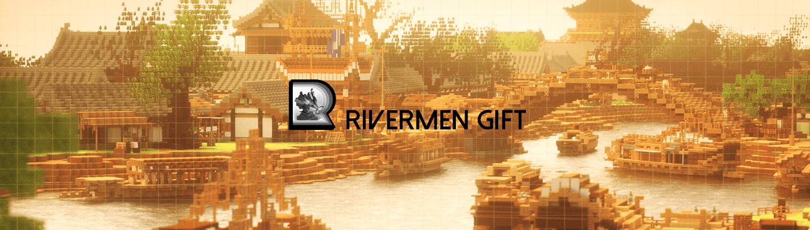

# RiverMenGift

汴河元宇宙是带着国风美学的元宇宙。 它致力于架设起物理与数字世界的价值互通桥梁，让虚拟成为现实的一部分，让用户价值真正有所呈现。 在这里，你可以在游戏化场景里创造与传递价值，在社交玩乐中交换与捕获价值。 醉卧河里宅，闲游河里集，登台河里剧院，冒险河里娱乐城… 这是属于你的web3盛世旅程，属于你大放异彩的时代。

合成是Rivermen的特殊玩法。合成的长卷NFT仅有10幅，用户需集齐202种职业人物，才能合成体素版《清明上河图》长卷NFT。长卷持有者享有特殊的权利与地位，例如高等治理权、优先空投等，还可以获得官方赠送的高价值土地。Rivermen未来将开启“汴河宇宙”，土地则是开启“汴河宇宙”的重要资产。

