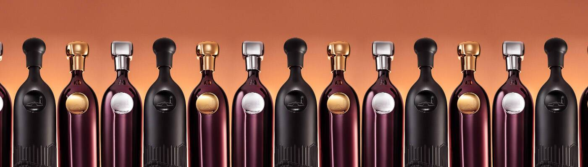

# Robert Mondavi Winery x Bernardaud Collection

罗伯特蒙大维酒庄 x Bernardaud
Robert Mondavi Winery 的灵魂——受到创始人 Robert Mondavi 的启发——是一位创造者、远见卓识和创新者的灵魂。凭借这些共同的特点和创造真正革命性的愿望，罗伯特蒙大维酒厂和传奇的法国瓷器品牌 Bernardaud 创造了一系列限量的 Limoges 陶瓷大酒瓶 (1.5L)，每一个都是手工雕刻的。为了向罗伯特蒙大维酒庄成立的那一年致敬，该系列共有 1,966 瓶酒，每一瓶都是灵感来自罗伯特蒙大维酒庄的葡萄园、葡萄酒和标志性酒厂的原创作品，每瓶酒都需要 50 名专业工匠近两周的时间来制作。结果是令人惊叹的设计和完美的功能在一个容器中。
MCMLXVI 系列
Robert Mondavi Winery 与法国豪华瓷器公司 Bernardaud 建立了首个此类合作伙伴关系，以彻底改变葡萄酒收集和鉴定的世界。为了向酒庄成立的那一年致敬，该系列名为“MCMLXVI”，以限量系列 1,966 件设计精美的 1.5 升瓶装利摩日瓷器为特色。Magnums 拥有由著名酿酒师 Robert Mondavi 酒厂技术委员会（Geneviève Janssens、Thomas Rivers Brown 和 Andy Erickson）打造的定制混合酒，这些酒来自纳帕谷标志性的 To Kalon® 葡萄园。每个瓶子都将通过生成艺术不可替代令牌 (NFT) 独家提供，每一个都是独特且具有收藏价值的艺术品。

