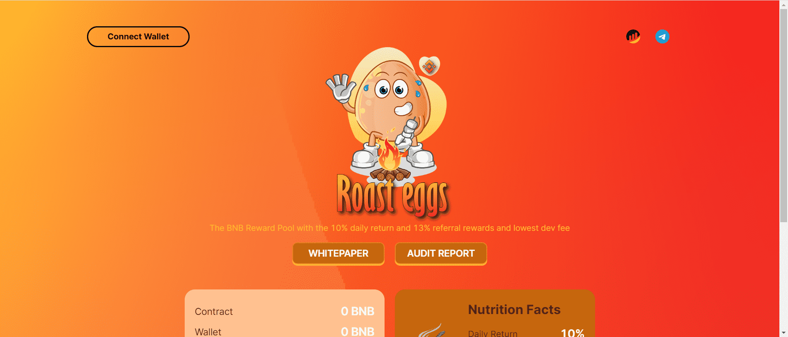

# Roasteggs

BNB 奖励池，每日 10% 回报和 13% 推荐奖励和最低的开发费用。 烤蛋矿工 币安智能链上的创新 DeFi 高达 10% 的每日回报和 13% 推荐奖励 完全验证和审计的合约

白皮书

EGGS的价格是多少？

鸡蛋没有固定价格。每个 BNB 的 TVL 越高，鸡蛋越多，TVL 越低，鸡蛋越少。这创造了公平的竞争环境，因此没有用户可以迟到。没有计算器可以解决这个问题。

我的每日百分比是多少？

每日百分比高达 10% 这取决于饮食习惯、一天中您重新烘烤或存放的时间以及 TVL 波动。日均回报率为 7-10%

