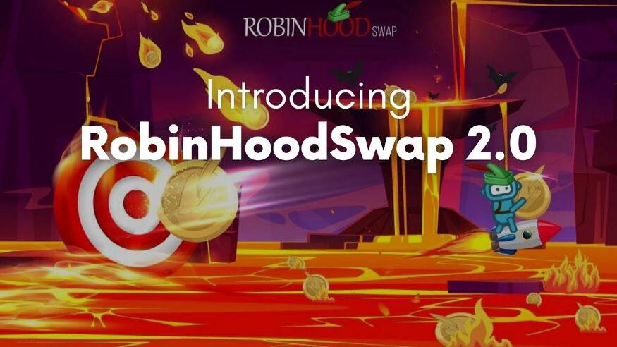

# RobinHoodSwap

RobinHoodSwap 是一个运行在币安智能链 (BSC) 上的单产农业生态系统。我们在 RobinHoodSwap 代币或 RBH 上运行。

RobinHoodSwap 的目标是让用户利用区块链和 DeFi 来获得奖励，同时通过回馈慈善组织来为社会做出贡献。它确实是一个繁荣与慈善相结合，创造更美好社会的平台。当您耕种时，会产生奖励，然后将其归因于回馈慈善机构。

由于 DeFi 多年来获得了极大的普及，它创造了一个独特的机会来引导流动性供应的奖励流以及对有意义的事物进行质押。作为一个单一的实体，实现这样的目标可能会令人生畏。但是数量上的优势，而生态系统中的每个参与者都将从中受益——这是一个指数级的收益。

RobinHoodSwap 将通过其治理和实用代币“RBH”实现其愿景。RBH 将首先用于质押以获得奖励，同时使开发人员能够获得这些奖励的一小部分以进一步推动目标，通过区块链和 DeFi 回馈慈善事业。

