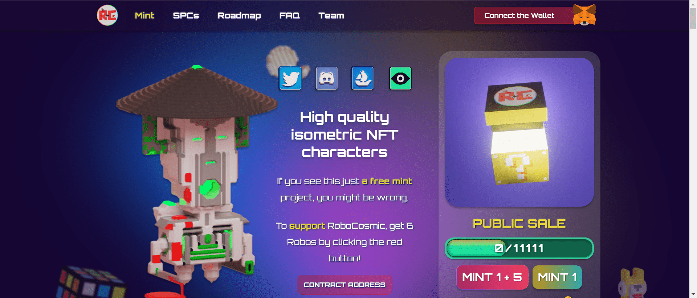

# RoboCosmic

RoboCosmic 是 11,111 个随机生成的 NFT 的数字集合，每个都不同，位于以太坊区块链上。

我们正在为即将到来的社区开放一个新的角色/空间。作为免费薄荷糖的发布，我们需要更多地关注营销。

所有早期支持 RoboCosmic 的投资者都将拥有一个 “机器人投资者”的角色。 并且，即使名称永久保留，也将在拥有不错的基金后关闭投资。

注意：如果我们将从其中一家 SPC 中获得至少一项投资，我们会将这些 SPC 退市 。因此，通常 SPC 不出售。我们认为，为了 项目的未来，我们可以牺牲其中一个，而不是与合作者空投。

