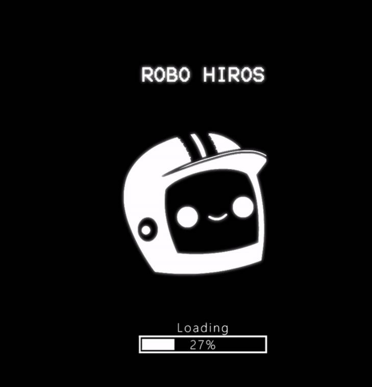

# RoboHiros v1.0

准备好成为 Hiro 了吗？ Planet Hiro 正在寻求向仅 7,777 台新机器人开放他们的社区。 我们工厂制造的机器人化身将为公民提供各种福利的独家访问权，以及在 Hiro 星球上的公民身份。 Robo Hiro 持有者获得对其 HIRO 的知识产权开发和所有权。▶ 什么是 RoboHiros v1.0？
RoboHiros v1.0 是一个 NFT（Non-fungible token）集合。 存储在区块链上的数字艺术品集合。
▶ 存在多少 RoboHiros v1.0 代币？
总共有 385 个 RoboHiros v1.0 NFT。 目前，75 位所有者的钱包中至少有一个 RoboHiros v1.0 NTF。
▶ 最近卖出了多少 RoboHiros v1.0？
过去 30 天内售出 0 个 RoboHiros v1.0 NFT。

