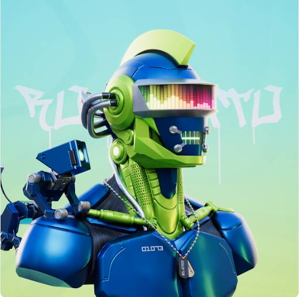

# Robomito

感官输入是你的定义。凭借其控制论身体所有不同部分的大量多样性，Robomito 将由超过数万亿种独特组合的数字制成。 因子工厂将创建3333个新的android身份并根据其性格进行修改，命运将其呈现给您的所有权。▶ 什么是机器人？
Robomito 是一个 NFT（非同质代币）集合。 存储在区块链上的数字艺术品集合。
▶ 有多少 Robomito 代币？
总共有 3,333 个 Robomito NFT。 目前，976 位车主的钱包中至少有一个 Robomito NTF。
▶ 最昂贵的 Robomito 销售是什么？
最昂贵的 Robomito NFT 是 Robomito #1047。 它于 2022-06-07（3 个月前）以 905.8 美元的价格售出。
▶ 最近卖出了多少 Robomito？
过去 30 天内售出了 32 个 Robomito NFT。
▶ Robomito 的价格是多少？
在过去 30 天里，最便宜的 Robomito NFT 销售额低于 5 美元，最高销售额超过 20 美元。 过去 30 天内，Robomito NFT 的中位价格为 10 美元。

