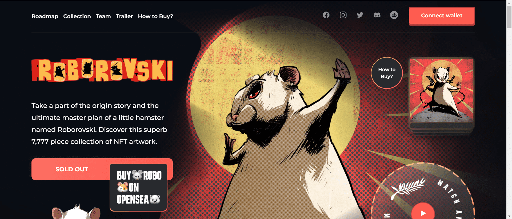

# Roborovski NFT

SYA Concept 的 Roborovski NFT 系列。

由好莱坞级企业 SYA Concept & Caravan 工作室发起的 NFT 项目。基于 Dev Patel 和 Tilda Cobham-Hervey 创建的角色。

了解一只名叫 Roborovski 的小仓鼠的起源故事和最终总体规划。发现这个包含 7,777 件 NFT 艺术品的精美收藏。

Caravan Studio 精心制作了讲述他的故事的 NFT 艺术品收藏，并为业主提供了独家电影。漫画书、电子游戏、电影和媒体艺术中最受尊敬的名字之一。

