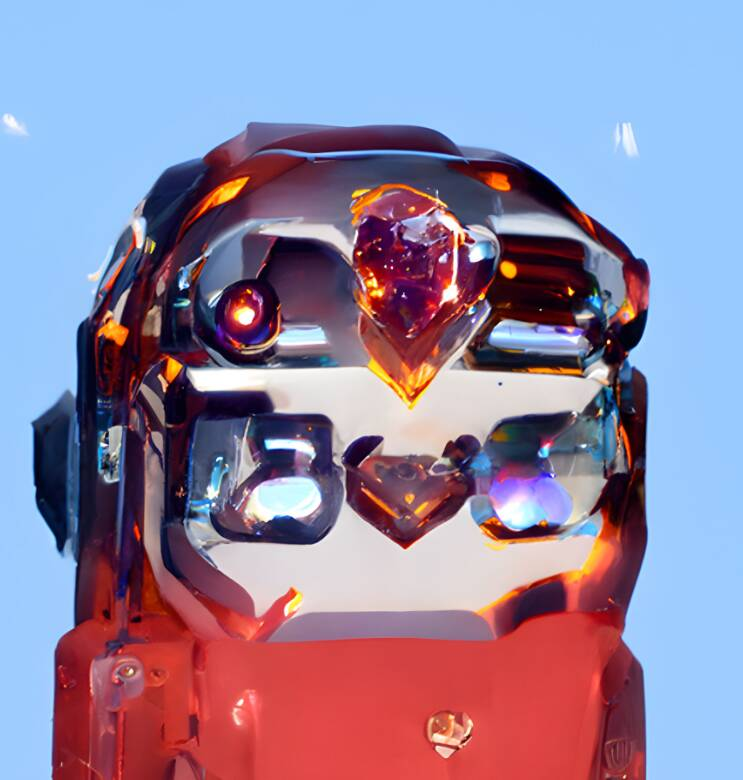

# Robotbird

人工智能为爱而战。 系列 I：AFFL 机器人鸟。 AFFL AI 艺术社区、技术乐观主义者、艺术爱好者的通行证。▶ 什么是机器人鸟？
Robotbird 是一个 NFT（Non-fungible token）集合。 存储在区块链上的数字艺术品集合。
▶ 有多少 Robotbird 代币？
总共有 6,746 个 Robotbird NFT。 目前，1,672 名所有者的钱包中至少有一个 Robotbird NTF。
▶ 最昂贵的 Robotbird 销售是什么？
售出的最昂贵的 Robotbird NFT 是 AFFL：robot bird #4096。 它于 2022-06-18（2 个月前）以 11 美元的价格售出。
▶ 最近卖出了多少 Robotbird？
过去 30 天内售出了 46 个 Robotbird NFT。
▶ Robotbird 的价格是多少？
在过去 30 天里，Robotbird NFT 最便宜的销售额低于 2 美元，最高销售额超过 5 美元。 过去 30 天内，Robotbird NFT 的中位价格为 2 美元。
▶ 什么是流行的 Robotbird 替代品？
许多拥有 Robotbird NFT 的用户还拥有 CivilizedApe、Women in Tech AI、Just A Square OFFICIAL 和 Super Painting Artwork。

