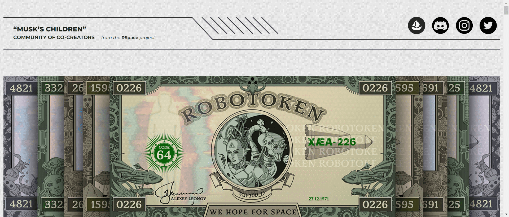

# ROBOTOKEN

ROBOTOKEN NFT 包含具有独特设计元素和专有语义的稀有数字内容。NFT 纸币包括 10 位为太空探索做出贡献的伟人的签名。只有 20 位业主能够收集所有十个签名。他们的 ENS 钱包名字将被刻在虚拟太空博物馆的大名人墙上，以感谢他们在太空博物馆创建中的帮助以及个人对社区发展的投资。

ROBOTOKENs象征着人类在太空探索中的成就的高度。在每个 NFT 的中心位置，描绘了来自集合的两个随机机器人。聪明友好的助手由人类制造，以应对太空常规并发展元宇宙。

用 ROBOTOKEN 改变一切！

