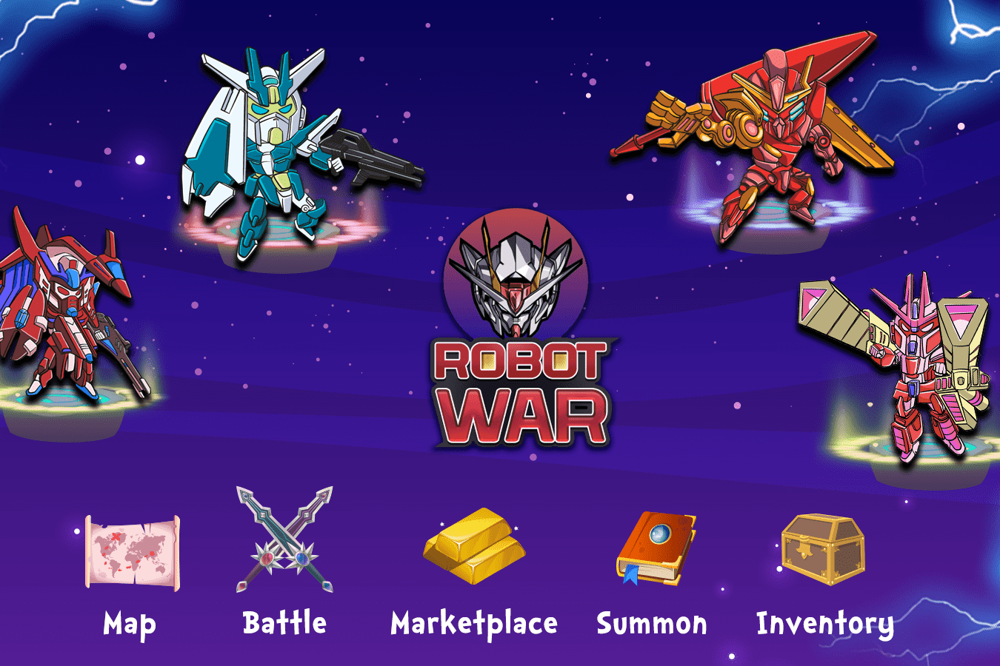

# RobotWars

RobotWars 采用 Play-to-Earn 范式通过游戏生成 WAR，同时通过未来功能提升用户 NFT 的价值。

‌

NFT 可以在市场上自由兑换为 WAR 代币，随后可以在交易所进行交易或转换为法定货币。

‌

目前，玩家可以使用以下方法开始赚钱：

‌

使用 Robot Warrior NFT 保护地球免受 Destroyer 的入侵并赚取 $WAR
收集元素以增加机器人战士的力量，从而增加每次防御的支出。
收集排名靠前的机器人战士，在 Marketplace 上以 $WAR 的价格买卖它们。
使用 DEX 将 $WAR 兑换成可以在 CEX 上交易的货币。
现在可以在 RobotWars 中访问的主要 NFT 是 Robot Warrior，它是在 RobotWars 中的 WARFARE 中战斗所必需的，并且只会随着玩家防御而增加价值。

‌

打开时，每个机器人战士从 1 级开始，并包括一个随机排名

‌

机器人战士的等级从 1 星到 6 星不等，取决于你的运气。WARFARE中的​​每一场战斗结束后，星级越高，奖励越好。

‌

目前没有办法改变机器人战士的等级。

