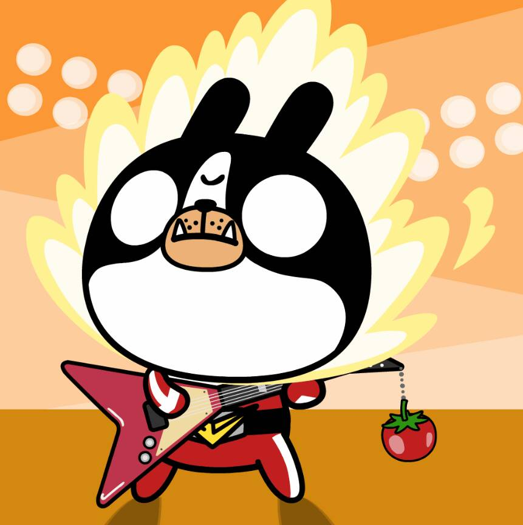

# Rockbunn

Rockbunn 是一群 3,333 个独特的想成为摇滚明星的兔子。 bunns 作为 ERC721 代币在以太坊区块链上生活和追求音乐事业。 有的时髦，有的调皮，有的有点边缘，但都充满激情地在舞台上表达自己的摇滚精神。 他们正等着你作为乐队经理来接他们，帮助他们发光，一起追求梦想。▶ 什么是 Rockbunn？
Rockbunn 是一个 NFT（不可替代令牌）集合。 存储在区块链上的数字艺术品集合。
▶ 有多少 Rockbunn 代币？
总共有 3,333 个 Rockbunn NFT。 目前，561 位车主的钱包中至少有一个 Rockbunn NTF。
▶ 最近卖出了多少个Rockbunn？
过去 30 天内共售出 0 个 Rockbunn NFT。
▶ 什么是流行的 Rockbunn 替代品？
许多拥有 Rockbunn NFT 的用户还拥有 Spike Planet、COTTON CANDY CAT、Crimson Clan 和 We are Dorkis。

