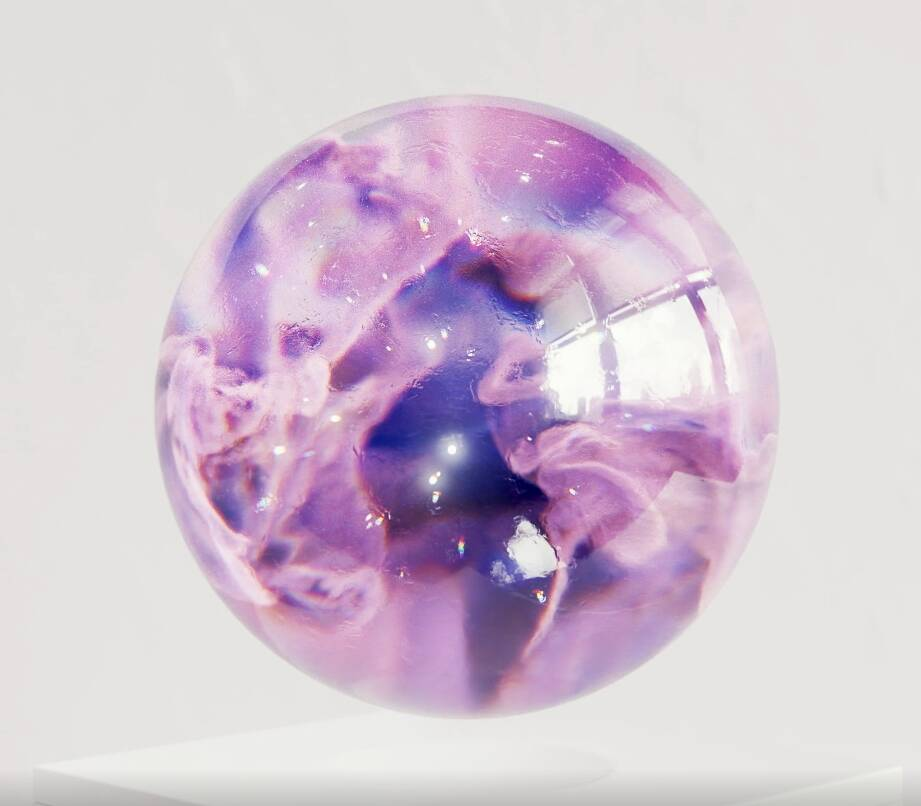

# Roger Kilimanjaro

该系列包含在 Nifty Gateway 上发布并撤回收藏家钱包的所有作品。Roger Kilimanjaro NFT 在过去 7 天内售出 2 次。 Roger Kilimanjaro 的总销售额为 590.9 美元。 一个 Roger Kilimanjaro NFT 的平均价格为 295.5 美元。 罗杰乞力马扎罗山拥有 133 名所有者，拥有 979 个代币的总供应量。▶ 什么是罗杰乞力马扎罗？
Roger Kilimanjaro 是一个 NFT（非同质代币）集合。 存储在区块链上的数字艺术品集合。
▶ 存在多少 Roger Kilimanjaro 代币？
总共有 979 个 Roger Kilimanjaro NFT。 目前，133 位车主的钱包中至少有一个 Roger Kilimanjaro NTF。
▶ 罗杰乞力马扎罗山最贵的拍卖是什么？
售出的最昂贵的 Roger Kilimanjaro NFT 是 1000 Spagoots #10/10。 它于 2022-08-27（2 天前）以 295.5 美元的价格售出。
▶ 最近卖出了多少罗杰乞力马扎罗山？
过去 30 天内售出了 4 个 Roger Kilimanjaro NFT。

