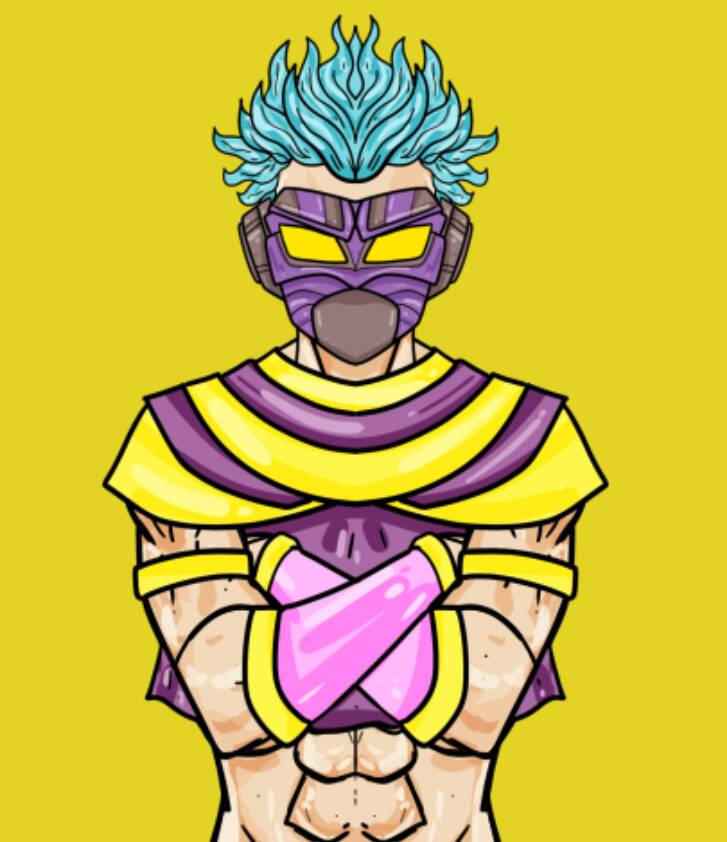

# RoninPunks

Ronin Punks 是一个数字艺术项目，由 6000 个程序生成的艺术作品组成，其中参考了武士文化、动漫、游戏、技术和电影。 艺术设计侧重于头发、面具、剑、西装等。NFT stats 为您提供有关 NFT 空间的最新信息。 如果您想找到最好的 NFT 购买、即将推出的 NFT 项目、最昂贵的 NFT 是什么——我们将为您提供您需要的数据、图表、见解和新闻。
本网站上的数据来自各种 NFT 市场和 NFT 项目创建者自己。 我们还直接从 Twitter 和 Discord 获取 NFT 社区统计数据。

