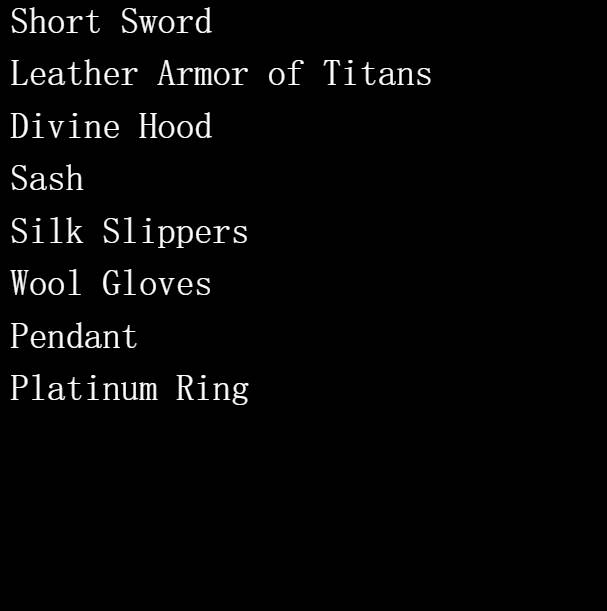

# Root Project

▶ 什么是根项目？
Root Project 是一个 NFT（Non-fungible token）集合。 存储在区块链上的数字艺术品集合。
▶ 存在多少个 Root Project 代币？
总共有 1,452 个 Root Project NFT。 目前 322 位所有者的钱包中至少有一个 Root Project NTF。
▶ 最近卖出了多少根项目？
过去 30 天内售出 0 个 Root Project NFT。Root 是一款冒险与战争的游戏。 Root 的奖杯是随机生成并存储在链上的冒险家装备。 故意省略统计信息、图像和其他功能以供其他人解释。

