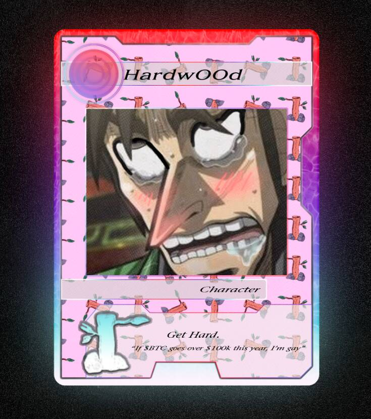

# Rope Makers United

▶ 什么是绳索制造者联盟？
Rope Makers United 是一个 NFT（非同质代币）集合。 存储在区块链上的数字艺术品集合。
▶ 存在多少 Rope Makers United 代币？
总共有 88 个 Rope Makers United NFT。 目前，732 位车主的钱包中至少有一个 Rope Makers United NTF。
▶ Rope Makers United 最昂贵的销售是什么？
最昂贵的 Rope Makers United NFT 是 Diamond Hands - Uncommon。 它于 2022-08-16（13 天前）以 140.7 美元的价格售出。
▶ 最近卖出了多少 Rope Makers United？
过去 30 天内共售出 1 个 Rope Makers United NFT。NFT 统计数据为您提供有关 NFT 空间的最新信息。 如果您想找到最好的 NFT 购买、即将推出的 NFT 项目、最昂贵的 NFT 是什么——我们将为您提供您需要的数据、图表、见解和新闻。

