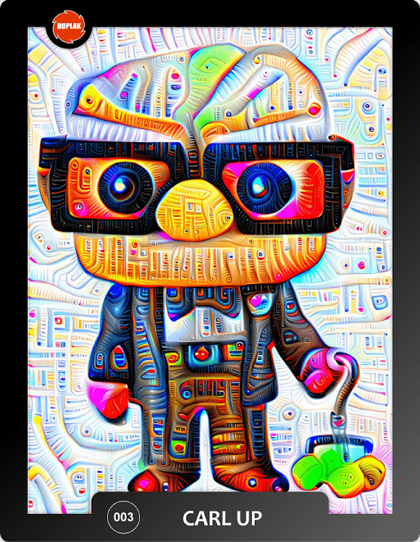

# ROPLAK

人工智能图像版最初由谷歌工程师 Alex Mordvintsev 开发，称之为 Deep Dream。它是一种用作计算机程序的算法，它使用神经网络来查找和增强图像中的某些模式。
人类倾向于在不同的情况下看到或感知不同的物体或图案，例如看到云中的形状或面部抽象图像。那是Pareidolia。AIIE 尝试使用卷积神经网络匹配相同的创建这些模式

卷积神经网络的工作原理
输入图像以检测第一层，通常是边缘。
第二步检测更高级别的特征，比如人脸。
将这些特征组合成一个全新的解释，生成一个独特的新版本的图像程序纹理是使用数学算法而不是存储信息创建的纹理，接近于低存储成本，具有几乎无限分辨率的简单纹理映射以及渲染图形的自然外观。

