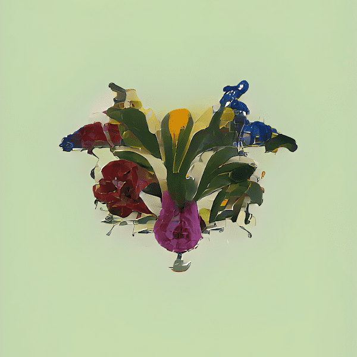

# Rorschach Meadow by Ash White

Ash White 是一位跨学科的设计师、开发人员和艺术家。他出生在肯特郡的英国乡村，他的实践跨越了 20 多年，并以身份和自然世界中的运动为主题。

从自学编程的背景开始，他的工作在从传统生成技术和机器学习到 3D 动画和声音设计的媒介之间漂移。

“Rorschach Meadow”是对我治疗时间的致敬。一次深刻而有意义的经历，帮助我重新发现了我所珍视的东西，那些给我带来成就感的东西，以及最终留下来的目标。

在那段时间里，我进行了各种基础练习，以帮助解决我一直在经历的感觉麻木，但没有一个比在外面更有效。我一直在大自然中发现的积极特性引导我探索植物学，以及更容易接近的园艺世界。一种需要耐心、计划、纪律、一点运气和一点信念的练习。随着时间的推移，我又开始有感觉了。感受平静，感受灵感，以及开始创造的冲动——我全心全意投入的激情。

这个项目是对帮助我应对抑郁症的三个核心组成部分的庆祝——治疗、园艺和艺术。

