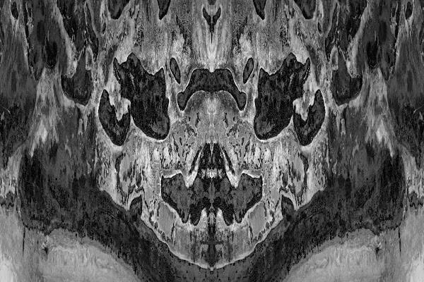

# Rorschach's

Rorschach's 是一个新系列，由 100 多幅抽象黑白作品组成，这些作品由我的摄影作品集中的各种照片创作而成。每张照片都旨在根据每个持有者的感知创建主观图像。该系列中的每张照片都是一张照片，每张照片都是您自己制作的不同故事。

▶ 什么是罗夏墨迹？

Rorschach's 是一个 NFT（不可替代代币）系列。存储在区块链上的数字艺术品集合。

▶ 罗夏代币有多少？

总共有 219 个罗夏 NFT。目前，95 位车主的钱包里至少有一张罗夏 NTF。

