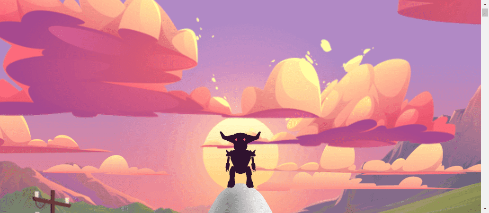

# Rovi Transporter

Rovies 是第一个程序生成的 NFT 同伴，它们在技术上能够穿越元宇宙。他们的法典允许 100,000 个变体，但只有 10101 个被合成是 Origin Rovies。所有 Rovies 都将在 Decentraland 的 3D 虚拟世界中成为 Rovi Play-to-Earn 宇宙中的可玩角色，并很快在他们自己的称为 Rovimatrix 的虚拟世界中成为可玩角色！

每个 Rovi 都通过自动化系统分配其物理特征和战斗数据，用于与其他 Rovi 作战，并为操作员赚取合成新一代 Rovi 所需的宝贵资源。

Rovies 是从 Polygon 网络上存储的 ERC721 代币合约的信息合成的，使它们与其他运营商交易更具成本效益。没有两个 Rovies 可以是相同的，并且只能由一个人拥有和经营。

