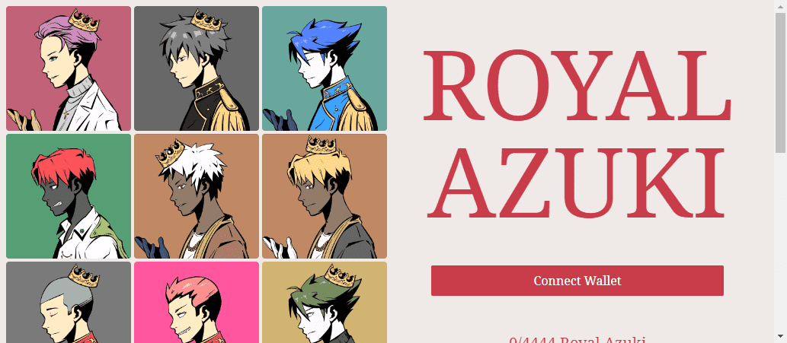

# RoyalAzuki

RoyalAzuki NFT - 常见问题（FAQ）
▶ 什么是RoyalAzuki？
RoyalAzuki 是一个 NFT（不可替代代币）集合。存储在区块链上的数字艺术品集合。
▶ 有多少 RoyalAzuki 代币？
总共有 3,063 个 RoyalAzuki NFT。目前，439 位车主的钱包中至少有一个 RoyalAzuki NTF。
▶ 最近卖出了多少 RoyalAzuki？
过去 30 天内共售出 0 个 RoyalAzuki NFT。
▶ 什么是流行的 RoyalAzuki 替代品？
许多拥有 RoyalAzuki NFT 的用户还拥有 EL NUMEROS、 DegenOkayBears、 WaterBe4nZuki和 Old Legacy。皇家小豆统计  创建于 5 个月前  3,063 代币供应  5% 费用  过去 7 天内没有出售 RoyalAzuki。

