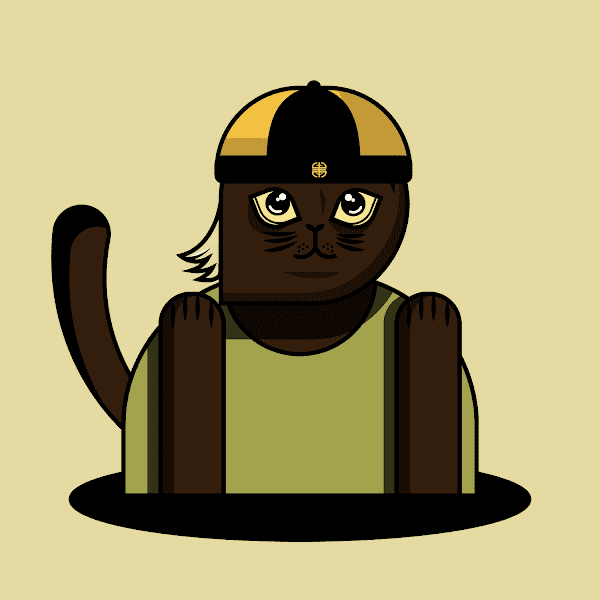

# RPC NFT Culture

什么是 Ready Player Cat (RPC) NFT Genesis？

Ready Player Cat (RPC) Genesis 是一个由 5,000 个 Ready Player Cat NFT 组成的有限 NFT 集合——既代表了 ETH 区块链上的独特数字收藏品，也代表了 MAO DAO 的会员资格以分享未来的治理权。

这里没有联合曲线，也没有价格等级。通过获得 25% 的折扣代码，购买一只 Ready Player Cat 的每个人花费 0.08 ETH 或低于 0.08 ETH。

当销售开始时，会有一个 LOOT_BOX_ROUND 概念。LOOT_BOX_ROUND 包括

- 最小战利品箱 id
- 最大战利品箱id
- 种子（在创建回合时设置，用于在当前回合销售完成后生成随机计数）
- 随机计数 (X)

在当前回合中的最后一个战利品箱（具有最大战利品箱 id）被售出后，智能合约使用“种子”执行以生成“随机计数 (X)”以自动重新排序。

