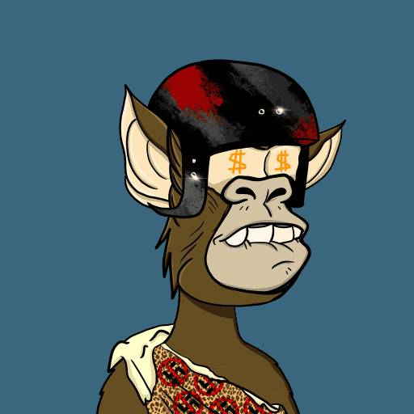

# RRAPE

RRAPE NFT - 常见问题（FAQ）
▶ 什么是 RRAPE？
RRAPE 是一个 NFT（不可替代代币）集合。存储在区块链上的数字艺术品集合。
▶ 存在多少个 RRAPE 代币？
总共有 1,110 个 RRAPE NFT。目前，564 位所有者的钱包中至少有一个 RRAPE NTF。
▶ 最昂贵的 RRAPE 销售是什么？
售出的最昂贵的 RRAPE NFT 是 RR/APE #359。它于 2022 年 6 月 29 日（2 个月前）以 11 美元的价格售出。
▶ 最近卖出了多少 RRAPE？
过去 30 天内售出了 10 个 RRAPE NFT。
▶ 什么是流行的 RRAPE 替代品？
许多拥有 RRAPE NFT 的用户还拥有 Bored Ape Celebrities Club、 PomeranianFam V2、 ARTface和 Cheap Tricks Club NFT。

