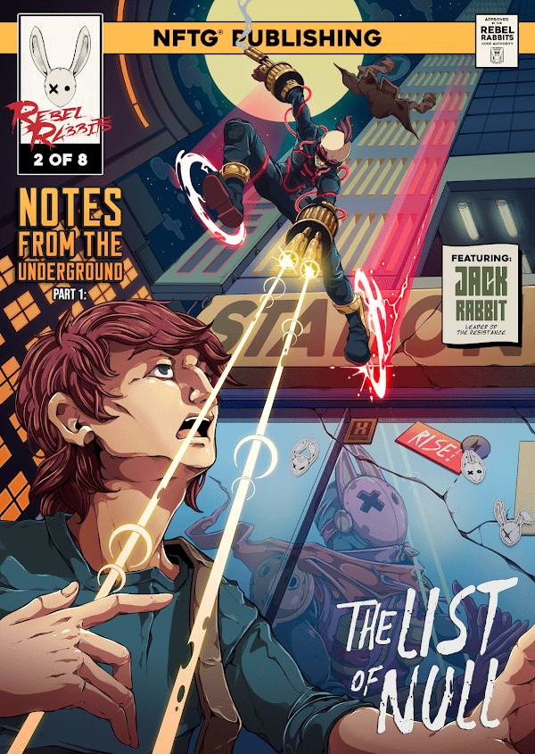

# RR Comic - Chapters 2-8 of Volume 1

我们是起义者。

这是第 1 卷的叛逆兔漫画第 2 章封面的合集。

第 2 章封面可兑换 3D 元界可穿戴设备！

Rebel Rabbit 超越了金融操纵的旧世界，转而支持分散的数字价值存储，其中权力从少数人手中夺取，并赋予多数人。戴上面具，你会看到。

你是叛逆的兔子。去中心化叛乱的早期采用者。

Rebel Rabbit 超越了金融操纵的旧世界，转而支持分散的数字价值存储，其中权力从少数人手中夺取，并赋予多数人。

戴上面具，你会看到。

要引导起义的能量及其所代表的意义，您必须戴上面具。您需要将该面具识别为 Rebel Rabbit；它还将为您的 MetaShell（盔甲）、武器和工具提供动力。面具选择了你——而不是相反。它代表了你是谁，反映了你内心的战士。

