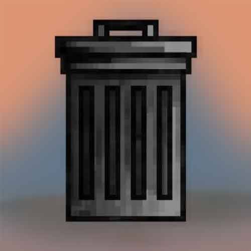

# Rubbish Trash

垃圾垃圾 NFT - 常见问题 (FAQ)
▶ 什么是垃圾？
垃圾垃圾是 NFT（不可替代令牌）集合。存储在区块链上的数字艺术品集合。
▶ 有多少垃圾垃圾代币？
总共有 1 个垃圾垃圾 NFT。目前，772 位所有者的钱包中至少有一个垃圾垃圾 NTF。
▶ 什么是最昂贵的垃圾销售？
出售的最昂贵的垃圾垃圾 NFT 是 The Trash。它于 2022-06-20（2 个月前）以 98.8 美元的价格售出。
▶ 最近卖出了多少垃圾？
过去 30 天内售出了 48 个垃圾 NFT。
▶ 一个垃圾箱要多少钱？
在过去 30 天里，最便宜的 Rubbish Trash NFT 销售额低于 8 美元，最高销售额超过 34 美元。过去 30 天内，垃圾 NFT 的中位价格为 12 美元。
▶ 有哪些流行的垃圾箱替代品？
许多拥有 Rubbish Trash NFT 的用户也拥有 RubbishBeast、 Samurai | Akane Yin， NASA OG和 To The .JPG。

